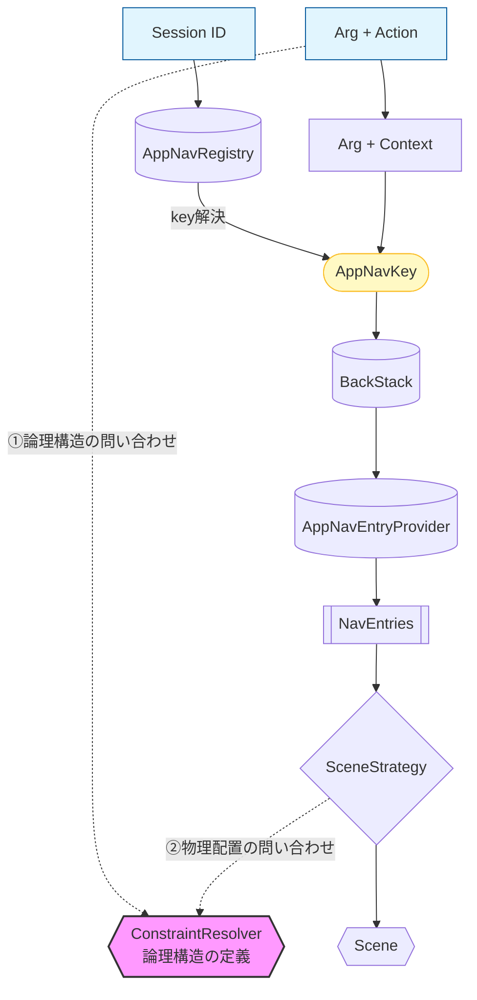

# AppNav 🚀

**AppNav** は、Android の次世代ナビゲーション基盤 `Navigation3` を高度に抽象化し、**「論理構造（Constraint）」と「物理配置（Scene）」の完全な分離**を実現するマルチレイアウト・フレームワークです。

> **Concept:**
> 実装者が UI コードの中で `if (isTablet)` や `isLandscape` を書く必要はありません。
> 「アプリがどうあるべきか」という骨格を定義すれば、AppNav がデバイス環境に応じて最適な姿を自動解決します。

---

## 🏗️ アーキテクチャ・フロー

AppNav は、論理構造（Constraint）を中心に、入力から出力までを一貫した規律で制御します。

---

## 🎨 コンセプト：論理構造と環境適応

AppNav はナビゲーションを「不変の論理」と「可変の物理」の 2 レイヤーに分離します。

### 1. Constraint (論理構造) = 「骨格」
特定の機能において、どのような「役割（Role）」が存在し、それらがどのような親子関係にあるかという家系図を定義します。
* **役割**: 「メイン」の中には「サポート」がある、といった論理的な繋がりを記述します。
* **分離**: ここには「左に置く」「全画面で出す」といった物理的な配置情報は一切含まれません。

### 2. Strategy & Scene (物理配置) = 「現像」
定義された骨格を、実行時のデバイス環境（画面幅など）に合わせてどう配置するかを決定します。
* **Strategy**: 現在の環境に最適な **Scene（舞台）** を一つ選別します。
* **Scene**: 選ばれた舞台が、各画面の Role を見て、適切な場所（Pane）へ案内します。

### 🍱 UI (NavEntry) = 「純粋な部品」
画面（UI）は、自分がどこに並べられているかを知る必要はありません。「自分はどの役割（Role）を担っているか」だけを認識し表示に専念することで、一つの UI コードを一切書き換えることなく、スマホとタブレットの両方で使い回すことが可能になります。

---

## 🎨 画面配置へのパイプライン：意志と制約の合成

AppNav において、画面の配置は固定のテンプレートに従うのではなく、定義された **「独自の骨格（Constraint）」** に基づいて動的に決定されます。

#### 1. 遷移の意志 (Action)
各画面は、次のアクションに対して物理的な配置ではなく、**論理的な振る舞い** をリクエストします。
* **`Stack`**: 現在のロールを維持し、履歴を積む。
* **`Expand`**: 現在のロールを子ロールに広げ履歴を始める。
* **`Replace`**: 現在のロールを維持し、履歴を始める。

#### 2. AppNavKey の動的合成
アクションは即座に **`Constraint`（骨格）** と照らし合わされ、具体的な **Role（役割）** へと解決されます。

> **AppNavKey = Arg (データ) + Context (役割・属性)**

この瞬間、レイアウトに依存した「意志」は蒸発し、純粋な「論理状態」へと変換されます。

#### 3. 配置の最終解決 (Strategy Resolution)
環境に応じた`Strategy`が、対応する`Layout`を注入した`Scene` を提供し、`Scene` が 適切に`NavEntry`をまとめ、`Layout`で定義される形で配置されます。

---

## 💎 手のかかる機能も同時に解決

### 🛡️ ユーザーの意図を汲む「削除遅延アルゴリズム」 (Persistence)
マルチペイン環境で「詳細画面を閉じる」のは明らかな破棄ですが、シングルペイン環境での「戻る」操作は、ユーザーが一時的に戻っただけなのか、完全に破棄したいのかが判別できません。
AppNav は画面切り替え時に即座にリソースを破棄せず、同一キーへの復帰なら状態を即座に復元。別の画面への遷移が確定した瞬間にクリーンアップを行います。

### 🆔 セッションの永続化と一意性 (Multiple BackStack)
すべての遷移は「Session」単位で管理され、用途に応じて 3 つのポリシーで一意性を保証します。
既知のセッションは `KeyRegistry` に登録することで、アプリ内のどこからでも一意に呼び出せます。

| ポリシー         | 特徴               |
|:-------------|:-----------------|
| **Specific** | **永続化 + シングルトン** |
| **Managed**  | **シングルトン**       |
| **General**  | **匿名セッション**      |

### 📨 生存期間同期型メッセージング (Messenger)
画面（NavEntry）同士の疎結合な通信基盤です。データの寿命を `NavEntry` の生存期間と強制同期させることで、画面の破棄と同時にメモリが自動清掃され、メモリリークを設計レベルで排除します。

### 🌳 家系図による階層制御 (Family Tree)
役割（Role）に親子関係を持たせています。親が閉じられた際、その子孫 Role も自動的に連動して破棄。複雑なマルチレイアウトにおいても、スタックの不整合や「子画面だけが残る」といった矛盾を許しません。

---

---

## 📂 主要モジュール構成

AppNav は、論理的なナビゲーション管理から物理的な画面描画までを、以下のモジュール群で提供します。

| ファイル名                        | 役割                                                                              |
|:-----------------------------|:--------------------------------------------------------------------------------|
| **`AppNavKey.kt`**           | **不変の身分証**。データ（Arg）と論理属性（Context）を保持する、スタック管理の最小単位です。                           |
| **`AppNavRegister.kt`**      | **セッション・インデックス**。特定のセッション ID から、事前定義された一意の `AppNavKey` を引き出します。                 |
| **`AppNavConstraint.kt`**    | **論理構造（DNA）の定義**。Role（役割）の親子関係や階層を記述するための DSL 基盤です。                             |
| **`AppNavBackStack.kt`**     | **履歴の番人**。解決された `AppNavKey` を時系列で保持し、アプリの論理的な「過去」を管理します。                        |
| **`AppNavEntries.kt`**       | **インテリジェント・スタック**。削除遅延アルゴリズムを内包し、論理履歴を UI のライフサイクルへ変換します。                       |
| **`AppNavSceneStrategy.kt`** | **環境適応の司令塔**。ウィンドウサイズ等の外部環境に応じて、適用すべき `Scene` を決定します。                           |
| **`AppNavSceneLayout.kt`**   | **舞台の現像ルール**。どの Role（役割）を、どの Pane（指定席）に配置するかという物理的な構成を定義します。                    |
| **`AppNavDisplay.kt`**       | **最終描画の出口**。選択された `Strategy` と `Entries` を合成し、実際の画面（UI）として投影します。                |
| **`AppNavController.kt`**    | **統合インターフェース**。実装者が `backstack` や `messager` などの操作を画面で行うことを単純化したメイン・エントリポイントです。 |
| **`AppNavMessenger.kt`**     | **ライフサイクル同期型通信**。画面の生存期間と連動し、メモリリークを防ぐ疎結合なメッセージ基盤です。                            |

---